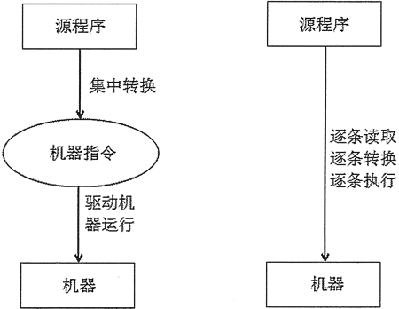

其实，程序指的就是一系列指令，用来告诉计算机做什么，而编写程序的关键在于，我们需要用计算机可以理解的语言来提供这些指令。

虽然借助 Siri（Apple）、Google Now（Android）、Cortana（Microsoft）等技术，我们可以使用汉语直接告诉计算机做什么，比如“Siri，打开酷狗音乐”，但使用过这些系统的读者都知道，它尚未完全成熟，再加上我们语言充满了模糊和不精确因素，使得设计一个完全理解人类语言的计算机程序，仍然是一个有待解决的问题。

为了有效避开所有影响给计算机传递指令的因素，计算机科学家设计了一些符号，这些符号各有其含义，且之间无二义性，通常被它们为编程语言。编程语言中的每个结构，都有固定的使用格式（称为语法）以及精确的含义（称为语义）。换句话说，编程语言指定了成套的规则，用来编写计算机可以理解的指令。习惯上，我们将这一条条指令称为计算机代码，而用编程语言来编写算法的过程称为编码。

本教程要讲解的 Python 就是一种编程语言，除此之外，你肯定也听说过其他一些编程语言，如 C、C++、Java、Ruby 等。至今，计算机科学家已经开发了成百上千种编程语言，且随着时间演变，这些编程语言又产生了多个不同的版本。但无论是哪个编程语言，也无论有多少个版本，虽然它们在细节上可能有所不同，无疑它们都有着固定的、无二义性的语法和语义。

以上提到的编程语言，都是高级计算机语言，设计它们的目的是为了方便程序员理解和使用。但严格来说，计算机硬件只能理解一种非常低级的编程语言，称为机器语言。

比如说，让计算机对 2 个数做求和操作，那么 CPU 可能要执行以下指令：

- 将位于内存空间位置在 2001 的数加载到 CPU 中；
- 再将位于内存空间位置在 2002 的数也加载到 CPU中；
- 在 CPU中，对这 2 个数做求和操作；
- 将结果存储在位置为 2003 的内存空间。

可以看到，对 2 个数执行求和操作需要做这么多工作，且这还只是笼统地描述，实际会更加复杂。

而使用 Python 这样的高级语言，对 2 个数求和可以很自然地用 c = a + b 表示，但由此带来的问题是，我们需要设计一种方法，将高级语言翻译成计算机可以执行的机器语言，有两种方法可以实现，分别是使用编译器和解释器。

> 使用编译器将自身等效转换成机器语言的高级语言，通常称为编译型语言；而使用解释器将自身转换成机器语言的高级语言，称为解释型语言，Python 就是解释型编程语言的一种。

# 1. 编译型语言和解释性语言

Python 是一门解释型的编程语言，因此它具有解释型语言的运行机制。

计算机程序，其实就是一组计算机指令的集合，能真正驱动机器运行的是机器指令，但让普通开发者直接编写机器指令是不现实的，因此就出现了计算机高级语言。高级语言允许使用自然语言（通常就是英语）来编程，但高级语言的程序最终必须被翻译成机器指令来执行。

高级语言按照程序的执行方式，可以分为编译型和解释型两种。

## 1.1 编译型语言

编译型语言是指使用专门的编译器，针对特定平台（操作系统）将某种高级语言源代码，一次性“翻译”成可被该平台硬件执行的机器语言（包括机器指令和操作数），并包装成该平台所能识别的可执行程序的格式，这个转换过程称为编译（Compile）。编译生成的可执行程序可以脱离开发环境，在特定的平台上独立运行。
编译器，可以理解为就是一个比较复杂的计算机程序，它可以接受一个以高级语言编写的程序，并将其翻译成以某个计算机的机器语言表达的等效程序。

有些程序编译结束后，还可能需要对其他编译好的目标代码进行链接，即组装两个以上的目标代码模块生成最终的可执行程序，通过这种方式实现低层次的代码复用。

因为编译型语言是一次性编译成机器语言的，所以可以脱离开发环境独立运行，而且通常运行效率较高。但因为编译型语言的程序被编译成特定平台上的机器码，因此编译生成的可执行程序通常无法移植到其他平台上运行，如果需要移植，则必须将源代码复制到特定平台上，针对特定平台进行修改，至少需要采用特定平台上的编译器重新编译。
现有的 C 、C++、Objective-C、Pascal 等高级语言都属于编译型语言。

### 1.1.1 半编译型语言

此外，还有一种伪编译型语言，如 Visual Basic，它属于半编译型语言，并不是真正的编译型语言。它首先被编译成 P-code 代码（中间代码），并将解释引擎封装在可执行程序内，当运行程序时，P-code 代码才会被解析成真正的二进制代码。

从表面上看，Visual Basic 可以编译生成可执行的 EXE 文件，而且这个 EXE 文件也可以脱离开发环境，在特定平台上运行，非常像编译型语言。实际上，在这个 EXE 文件中，既有程序的启动代码，也有链接解释程序的代码，而这部分代码负责启动 Visual Basic 解释程序，再对 Visual Basic 代码进行解释并执行。

## 1.2 解释型语言

解释型语言是指使用专门的解释器，将源程序逐行解释成特定平台的机器代码并立即执行的语言。

解释型语言通常不会进行整体性的编译和链接处理，解释型语言相当于把编译型语言中的编译和解释过程混合到一起同时完成。

可以这样认为，每次执行解释型语言的程序都需要进行一次编译，因此解释型语言的程序运行效率通常较低，而且不能脱离解释器独立运行。但解释型语言有一个优势，就是跨平台比较容易，只需提供特定平台的解释器即可，每个特定平台上的解释器都负责将源程序解释成特定平台的机器指令。
也就是说，解释型语言可以方便地实现源程序级的移植，但这是以牺牲程序执行效率为代价的。

## 1.3 插曲：Java 是什么类型的语言

Java这个语言很非凡。 

1. 你可以说它是编译型的。因为所有的Java代码都是要编译的，.java不经过编译就什么用都没有。 
2. 你可以说它是解释型的。因为java代码编译后不能直接运行，它是解释运行在JVM上的，所以它是解释运行的，那也就算是解释的了。 
3. 但是，现在的JVM为了效率，都有一些JIT优化。它又会把.class的二进制代码编译为本地的代码直接运行，所以，又是编译的。

像C、C++ 他们经过一次编译之后直接可以编译成操作系统了解的类型，可以直接执行的 所以他们是编译型的语言。没有经过第二次的处理 而Java不一样他首先由编译器编译成.class类型的文件，这个是java自己类型的文件 然后在通过虚拟机(JVM)从.class文件中读一行解释执行一行，所以他是解释型的语言，而由于java对于多种不同的操作系统有不同的JVM所以 Java实现了真正意义上的跨平台！ 
请观看下面两张图 了解一下Java的虚拟机机制：

(1) java语言的编译-->解释--->执行过程 

(2) java的虚拟机 

今天听到同事在讨论java是哪种类型的语言（编译型、解释型），以前稍微有些接触，但是概念比较模糊，为了不至于让别人的思想左右自己，所以查了些资料，找到了很多热心网友给出的答案，终于有些明白。这里先给出编译型语言和解释型语言的定义。 

定义： 
- 编译型语言：把做好的源程序全部编译成二进制代码的可运行程序。然后，可直接运行这个程序。 
- 解释型语言：把做好的源程序翻译一句，然后执行一句，直至结束！

区别： 
- 编译型语言，执行速度快、效率高；依靠编译器、跨平台性差些。 
- 解释型语言，执行速度慢、效率低；依靠解释器、跨平台性好。 

个人认为，java是解释型的语言，因为虽然java也需要编译，编译成.class文件，但是并不是机器可以识别的语言，而是字节码，最终还是需要 jvm的解释，才能在各个平台执行，这同时也是java跨平台的原因。所以可是说java即是编译型的，也是解释型，但是假如非要归类的话，从概念上的定义，恐怕java应该归到解释型的语言中。 

附： 
编译型的语言包括：C、C++、Delphi、Pascal、Fortran 
解释型的语言包括：Java、Basic、javascript

## 1.4 编译型语言PK解释型语言

编译型语言和解释型语言的对比如图 1 所示。

图 1 编译型语言和解释型语言

借助图 1 不难理解，编译型语言和解释型语言的区别在于，编译是对高级语言程序进行一次性翻译，这样的好处是，一旦源程序被彻底翻译，它就可以重复运行，且今后都不再需要编译器和源代码；而如果使用解释器，则高级语言程序每次运行，都需要借助源程序和解释器，其最大的好处就是，程序有很好的可移植性。

本教程所讲的 Python 语言，属于解释型语言，因此运行 Python 程序时需要使用特定的解释器进行解释、执行。解释型的 Python 语言天生具有跨平台的能力，只要为 Python 提供相应平台的解释器即可。

# 2. Python 的诞生

> 有人说，之所以 Guido 会选择 Python 作为该编程语言的名字，是因为他是一个叫 Monty Python 戏剧团体的忠实粉丝。

Python 语言是基于 ABC 教学语言的，而 ABC 这种语言非常强大，是专门为非专业程序员设计的。但 ABC 语言并没有获得广泛的应用，Guido 认为是非开放造成的。

> ABC 是一种交互式、结构化的高级语言，旨在替代 BASIC、Pascal等语言，用于教学以及原型软件设计。值得一提的是，Python 创始人 Guido 曾在 ABC 系统开发中工作了数年。

Guido 在 Python 中避免了 ABC 不够开放的劣势，加强了 Python 和其他语言如 C、C++ 和 Java 的结合性，令其具有丰富而强大的库，能够把使用其他语言制作的各种模块（尤其是 C 和 C++）很轻松地联结在一起，因此 Python 又常被称为“胶水”语言。

> 这里的模块，可以简单理解为一个个可实现各种不同功能的方法（也可称为函数）。

Python 的设计哲学为优雅、明确、简单，实际上，Python 始终贯彻着这一理念，以至于如今网络上流传着“人生苦短，我用 Python”的说法。Python 上手非常简单，它的语法非常像自然语言，对非软件专业人士而言，选择 Python 的成本最低，因此某些医学甚至艺术专业背景的人，往往会选择 Python 作为编程语言。

正是由于 Python 所具有的这些特性，使得其自 1991 年 Python 第一个公开发行版问世后，自 2004 年起 Python 的使用率呈线性增长，不断受到编程者的欢迎和喜爱；2010 年，Python 荣膺 TIOBE 2010 年度语言桂冠；2017 年，IEEE Spectrum 发布的 2017 年度编程语言排行榜中，Python 位居第 1 位。

## 2.1 特点

我们已经不止一次讲过，Python 是一种面向对象、解释型的脚本语言，同时也是一种功能强大而完善的通用型语言。相比其他编程语言（比如 Java），Python 代码非常简单，上手非常容易。

举个简单的例子，比如要完成某个功能，如果用 Java 需要 100 行代码，但用 Python 可能只需要 20 行代码，这是 Python 具有巨大吸引力的一大特点。

不仅如此，Python 还有其他的特点，下面就给大家做一下总结。

### Python 特点：简单易学
Python 是一种代表简单注意思想的语言，阅读一个良好的 Python 程序，即使是在 Python 语法要求非常严格的大环境下，给人的感觉也像是在读英语段落一样。

换句话说，Python 编程语言最大的优点之一，是其具有伪代码的特质，它可以让我们在开发 Python 程序时，专注于解决问题，而不是搞明白语言本身。

###  Python 特点：开源
Python 是  FLOSS（自由/开源源码软件）之一，简单地理解就是，用户使用 Python 进行开发和发布自己编写的程序，不需要支付任何费用，也不用担心版权问题，即使作为商业用途，Python 也是免费的。

开源正在成为软件行业的一种发展趋势，现在有很多商业软件公司都开始将自己的产品变成开源的（例如 Java）。也许，Python 的开源正是它如此优秀的原因之一，因为会有这么一群人，他们希望看到一个更加优秀的 Python，从而为了这个目标，不断地对 Python 进行创造，不断地改进。

### Python 特点：高级语言

Python 是高级语言，因此当使用 Python 语言编写程序时，我们无需再考虑一些底层细节方面的问题。例如，如何管理程序使用的内存等等。

### Python 特点：解释型语言

一个用编译型语言（如 C 或 C++）写的程序，可以从源文件转换到一个计算机使用的语言。这个过程主要通过编译器完成。当运行程序的时候，我们可以把程序从硬盘复制到内存中并且运行。

而 Python 语言写的程序，则不需要编译成二进制代码，可以直接从源代码运行程序。在计算机内部，由 Python 解释器把源代码转换成字节码的中间形式，然后再把它翻译成计算机使用的机器语言并运行。

事实上，由于不再担心如何编译程序，使得使用 Python 变得更加简单，我们只需要将 Python 程序复制到另外一台计算机上，它就可以工作了。因此，Python 程序更加易于移植。

### Python 特点：可移植性

由于 Python 是开源的，它已经被移植到许多平台上。如果能够避免使用依赖系统的特性，那就意味着，所有 Python 程序都无需修改就可以在好多平台上运行，包括 Linux 、Windows、FreeBSD、Solaris 等等，甚至还有 PocketPC、Symbian 以及 Google 基于 Linux 开发的 Android 平台。

解释型语言几乎天生就是跨平台的。Python 作为一门解释型的语言，它天生具有跨平台的特征，只要为平台提供了相应的 Python 解释器，Python 就可以在该平台上运行。

### Python 特点：面向对象

Python 既支持面向过程编程，也支持面向对象编程。在“面向过程”的语言中（如 C 语言），程序仅仅是由可重用代码的函数构建起来的；而在“面向对象”的语言（如 C++）中，程序是由数据和功能组合而成的对象构建起来的。

与其他编程语言（如 C++ 和 Java）相比，Python 是以一种非常强大，而又简单的方式实现的面向对象编程。

### Python 特点：强大的功能

Python 强大的功能也许才是很多用户支持 Python 的最重要的原因，从字符串处理到复杂的 3D 图形编程，Python 借助扩展模块都可以轻松完成。

实际上，Python 的核心模块已经提供了足够强大的功能，使用 Python 精心设计的内置对象可以完成许多功能强大的操作。

此外，Python 的社区也很发达，即使一些小众的应用场景，Python 往往也有对应的开源模块来提供解决方案。

###  Python 特点：可扩展性

Python 的可扩展性体现为它的模块，Python 具有脚本语言中最丰富和强大的类库，这些类库覆盖了文件 I/O、GUI、网络编程、数据库访问、文本操作等绝大部分应用场景。

Python 可扩展性一个最好的体现是，当我们需要一段关键代码运行的更快时，可以将其用 C 或 C++ 语言编写，然后在 Python 程序中使用它们即可。

除了以上几个特点（也可称之为优点）之外，作为一个解释型语言，Python 自然也有一些弱点，比如：

- 速度慢：Python 程序比 Java、C、C++ 等程序的运行效率都要慢。
- 源代码加密困难：不像编译型语言的源程序会被编译成目标程序，Python 直接运行源程序，因此对源代码加密比较困难。

其实，这两个缺点并不是什么大问题，首先，由于目前计算机的硬件速度越来越快，软件工程往往更关注开发过程的效率和可靠性，而不是软件的运行效率；至于第二个问题就更不是问题了，现在软件行业的大势本就是开源，就像 Java 程序同样很容易反编译，但丝毫不会影响它的流行。

# 3. 感受

“编程零基础，可以学习 Python 吗”，这是很多初学者经常问我的一个问题。当然，在计算机方面的基础越好，对学习任何一门新的编程语言越有利。但如果你在编程语言的学习上属于零基础，也不用担心，因为无论用哪门语言作为学习编程的入门语言，总是要有一个开始。

就我个人的观点，Python 作为学习编程的入门语言是再合适不过的。凡是在大学计算机专业学习过 C 语言的同学都感同身受，认为 C 语言不是很好的入门语言，很多曾经立志学习编程的读者，在学习了 C 语言之后，就决心不再学习编程。因此，是否学会 C 语言，好像成为了进入编程行业的筛选标准。

但是，如果将 Python 作为编程入门语言，就不会出现类似 C 语言的那些窘境问题。目前，逐渐有高校开始使用 Python 作为软件专业大学生（甚至也包含非软件专业）的入门编程语言。

本教程始终贯彻的思想就是，零基础也能学 Python，教程的目标就是和初学者一起，从零基础开始学习 Python。因此，编程零基础的你，无需犹豫，尽管放胆来学。

除此之外，很多初学者还面临这样一个问题，那就是教程已经学完啦，教程中的代码也都已经亲自编写并运行通过了，但还是不知道如何开发一个真正的应用程序，面对问题还是不知道如何下手解决。

如果你深有同感，只能说明你缺乏练习，代码编辑量太少。从编程零基础到专业程序员的过程，除了学习更多的基础知识，更要刻意地去培养自己的编程思维，这没有捷径，只有靠不断积累自己的代码量。

当然，增加代码量并不是要我们去盲目地编写代码，如果找不到增加代码量的方向，可以从阅读别人的代码开始。需要注意的是，在阅读他人编写的代码时，要边阅读边思考，多问几个为什么，例如代码为什么要这么写，有什么意图，有没有更简单的方法可以实现等等，必要情况下还可以给代码进行必要的注释。不仅如此，在完全理解他人代码的前提下，还可以试图对代码做修改，实现一些自己的想法。做到这些，才能说明你将别人的代码消化吸收了。

初学者在写代码或者调试代码的过程中，肯定会遇到很多问题，怎么办呢？最好的方法就是借助网络寻找答案，看看类似的问题别人是如何解决的，千万不要总是局限在自己的思维范围中。在这里，给大家推荐一个专门针对编程答疑解惑的网站 Stack OverFlow。